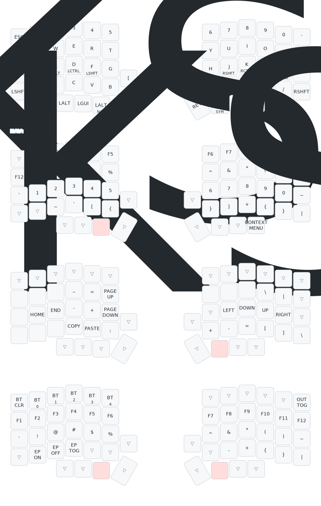
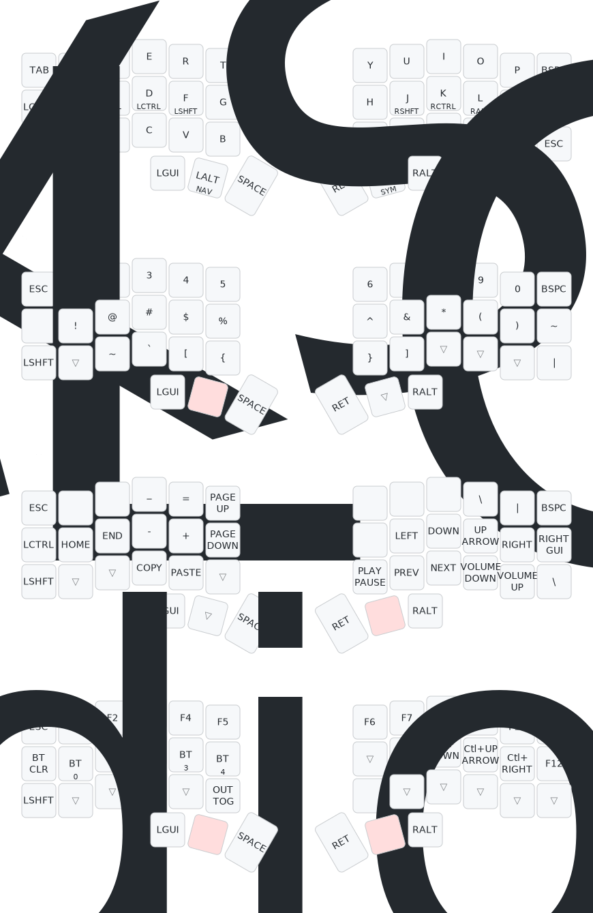
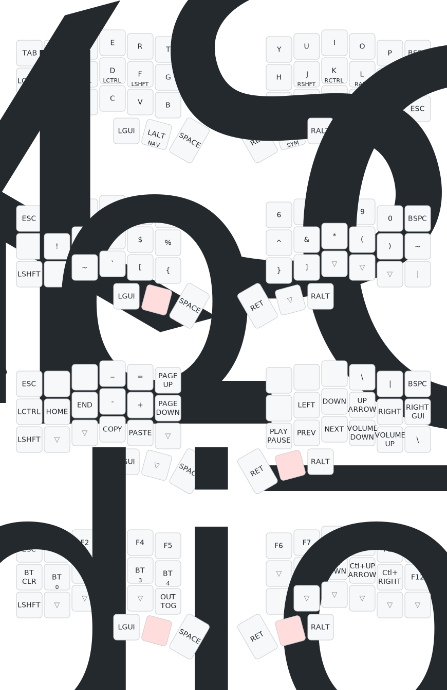
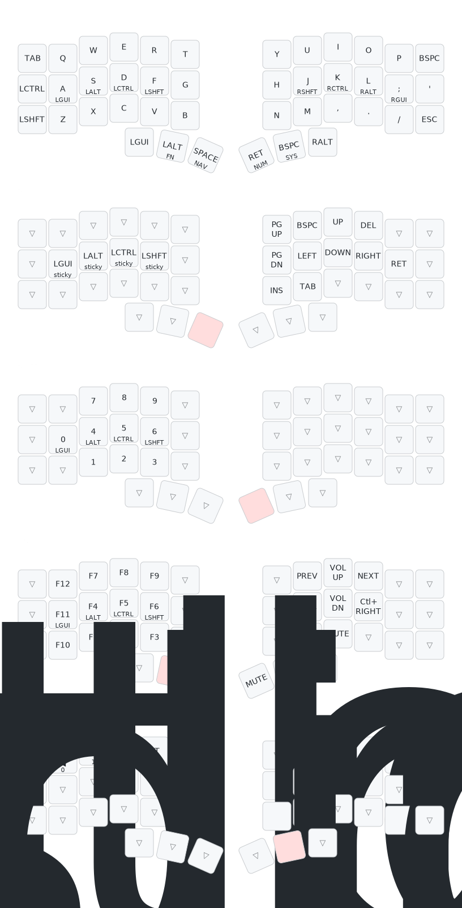
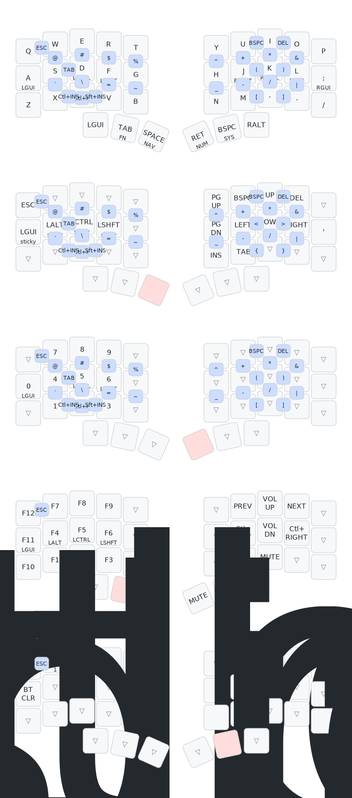

# zmk-config

Personal ZMK configuration covering five firmware targets:

| Keyboard  | Board / Shield                                    | Notes                              |
|-----------|----------------------------------------------------|------------------------------------|
| Lily58    | nice_nano_v2 + lily58 + nice_view (upstream)      | 58-key column-stagger              |
| Corne     | nice_nano_v2 + corne + nice_view (upstream)       | 6-col Corne                        |
| Blecorne  | blecorne_left/right (in-tree board)               | Boardsource Wireless Corne SMT     |
| Toucan 42 | seeeduino_xiao_ble + toucan + nice_view_gem       | Trackpad + display, urob HRMs      |
| Toucan 36 | seeeduino_xiao_ble + toucan36 + nice_view_gem     | 5-col variant, urob HRMs + combos  |

## Build

GitHub Actions builds every push (see `.github/workflows/build.yml`).

For a local build:
```
west init -l config && west update
west build -s zmk/app -b <board> -- -DSHIELD=<shield> -DZMK_CONFIG=$(pwd)/config
```

## Keymaps

| Keyboard | Layout |
|---|---|
| Lily58 |  |
| Corne |  |
| Blecorne |  |
| Toucan 42 |  |
| Toucan 36 |  |

SVGs are auto-generated by [keymap-drawer](https://github.com/caksoylar/keymap-drawer) and committed via CI on every keymap change.

## Layout

- All keyboards share the same five-layer scheme: BASE / NAV / SYM / ADJ (lily58/corne/blecorne) or BASE / NAV / NUM / FN / SYS (toucan).
- Toucan 42 and Toucan 36 use timerless home-row mods (urob style) via `urob/zmk-helpers`.
- Toucan 36 has 35 combos defined in `config/combos.dtsi`.
